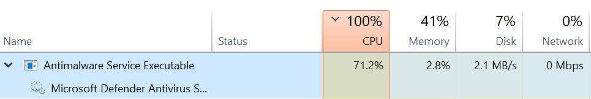
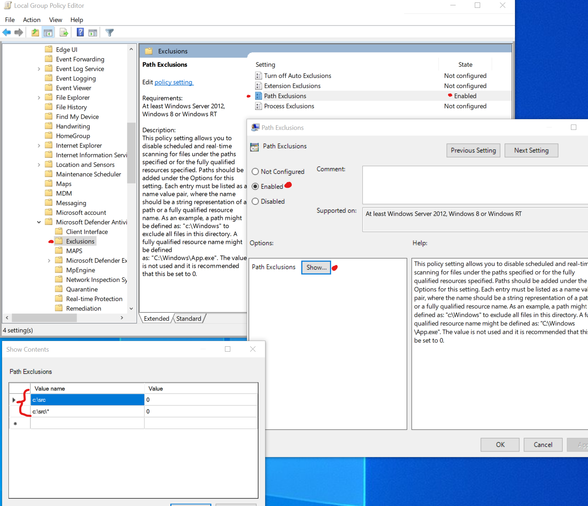

I was fortunate enough to receive a laptop for development work during quarantine. It works well so far except for one important issue, development work is slow! Turns out it can be difficult to program when the simple act of running visual studio grinds the machine down to a halt. At first I thought it was VS itself, until I opened up the task manager and saw the nightmare pictured below:

The root of this problem turned out to be Defender scanning my `c:/src` folder. Y'know, the folder that contains dozens of repositories and tens of thousands of files, many of which containing tens of thousands of lines of text?

"Great!" I thought, "Can I even get around this?" Work computers generally have strict policies to keep them well protected. After attempting to get Defender to ignore my source folder to no avail, I did the next best thing: I grumbled to coworkers hoping they knew of a workaround. Turns out, they did! I was sent [this handy guide](https://docs.microsoft.com/en-us/windows/security/threat-protection/microsoft-defender-antivirus/configure-extension-file-exclusions-microsoft-defender-antivirus#use-group-policy-to-configure-folder-or-file-extension-exclusions) that resolved my issue. Note that you'll need admin privileges to do this. Obligatory: You're responsible for whatever you do with your PC.

The steps from the guide are as follows: In windows search, find and open "Edit Group Policy." Now navigate to Computer Configuration → Administrative Templates → Windows Components → Microsoft Defender Antivirus → Exclusions. Enable it then click "Show" next to Path Exclusions. Add a path under `Value Name` and set `0` as its value. I've added `C:/src` to ignore all source code on my machine.

It's been about a month since I've made this change and Defender no longer chokeholds my laptop during dev work. Now about Teams...