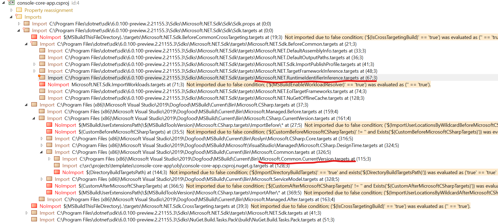

In any given .NET build, you might notice two properties that effectively have the same meaning, `Platform` and `PlatformTarget`. But what the heck is the difference between the two, and why does `PlatformTarget` exist? Let’s go on this journey together.

First of all, `PlatformTarget` is important because it’s passed to the compiler (among other important tasks)in `Microsoft.Common.CurrentVersion.targets` but that file does not define `PlatformTarget`. Weird, right? `PlatformTarget` being passed to these tasks has existed for 5+ years now, so `PlatformTarget` isn’t a “recent” concept. It is, however, defined in any .NET Framework project file. The fact that it’s defined in these older projects (based on `Configuration|Platform`) proves that it needs to be defined either in the project, or in some props/targets file before the `CoreCompile` target runs (from the Roslyn targets).

This answers how `PlatformTarget` is set & used in legacy-style projects: `PlatformTarget` is defined to a specific value when building under a particular `Configuration|Platform`. It is then passed to the compiler and so on.

This answers how `PlatformTarget` is set & used in legacy-style projects: `PlatformTarget` is defined to a specific value when building under a particular `Configuration|Platform`. It is then passed to the compiler and so on.

What about sdk-style projects?

I found this in `Microsoft.NET.Sdk.props`

```xml
* We cannot just set $(PlatformTarget) to $(Platform) here because $(Platform) can be set to anything
       at the solution level, but there are a fixed set valid $(PlatformTarget) values that can be passed
       to the compiler. It is up to the user to explicitly set PlatformTarget to non-AnyCPU (if desired)
       outside the 1:1 defaults below.
  -->
  <PropertyGroup>
    <_PlatformWithoutConfigurationInference>$(Platform)</_PlatformWithoutConfigurationInference>
  </PropertyGroup>
  <PropertyGroup Condition=" '$(_PlatformWithoutConfigurationInference)' == 'x64' ">
    <PlatformTarget Condition=" '$(PlatformTarget)' == '' ">x64</PlatformTarget>
  </PropertyGroup>
  <PropertyGroup Condition=" '$(_PlatformWithoutConfigurationInference)' == 'x86' ">
    <PlatformTarget Condition=" '$(PlatformTarget)' == '' ">x86</PlatformTarget>
  </PropertyGroup>
  <PropertyGroup Condition=" '$(_PlatformWithoutConfigurationInference)' == 'ARM' ">
    <PlatformTarget Condition=" '$(PlatformTarget)' == '' ">ARM</PlatformTarget>
  </PropertyGroup>
```

It looks like `PlatformTarget` is set based on `Platform` when it doesn’t have a value already set, but doesn’t have a definition when `Platform` is AnyCPU. So what happens when `Platform` is `AnyCPU`?

The following snippet looks to answer my question. It defaults `PlatformTarget` in `Microsoft.NET.RuntimeIdentifierInference.targets`:

```xml
<! - Determine PlatformTarget (if not already set) from runtime identifier. →
 <Choose>
    <When Condition="'$(PlatformTarget)' != '' or '$(RuntimeIdentifier)' == ''" />
    <When Condition="$(RuntimeIdentifier.EndsWith('-x86')) or $(RuntimeIdentifier.Contains('-x86-'))">
        <PropertyGroup>
            <PlatformTarget>x86</PlatformTarget>
        </PropertyGroup>
    </When>
    <When Condition="$(RuntimeIdentifier.EndsWith('-x64')) or $(RuntimeIdentifier.Contains('-x64-'))">
        <PropertyGroup>
            <PlatformTarget>x64</PlatformTarget>
        </PropertyGroup>
    </When>
    <When Condition="$(RuntimeIdentifier.EndsWith('-arm')) or $(RuntimeIdentifier.Contains('-arm-'))">
        <PropertyGroup>
            <PlatformTarget>arm</PlatformTarget>
        </PropertyGroup>
    </When>
    <When Condition="$(RuntimeIdentifier.EndsWith('-arm64')) or $(RuntimeIdentifier.Contains('-arm64-'))">
        <PropertyGroup>
            <PlatformTarget>arm64</PlatformTarget>
        </PropertyGroup>
    </When>
    <Otherwise>
        <PropertyGroup>
            <PlatformTarget>AnyCPU</PlatformTarget>
        </PropertyGroup>
    </Otherwise>
 </Choose>
```

`PlatformTarget` appears to be set here (if not already set) based off of the RuntimeIdentifier. And to confirm that this all happens before `M.C.CV.targets`, see the order of imports:



So we know now that `PlatformTarget` is defined in the sdk in both `Microsoft.NET.Sdk.props` and `Microsoft.NET.RuntimeIdentifierInference.targets`.

This answers my question for sdk-style projects: `PlatformTarget` is defined based on specific values of Platform and `RuntimeIdentifier`. And defaulted to AnyCPU when `Platform` isn’t a predetermined value, or it couldn’t be parsed from the RID.

### TL;DR
`PlatformTarget` is derived from `Platform` in a .NET Framework project file when `Platform` falls under a set of predetermined values. Otherwise it’s defined in the .NET Sdk based on `Platform` or `RuntimeIdentifier`.